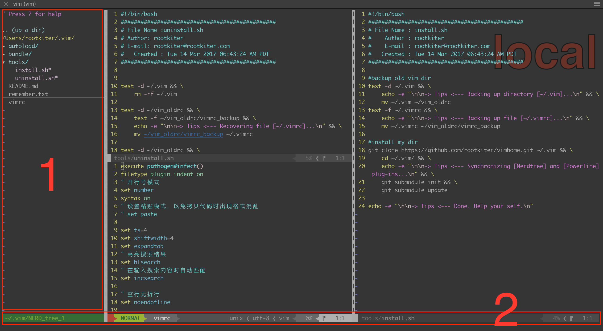
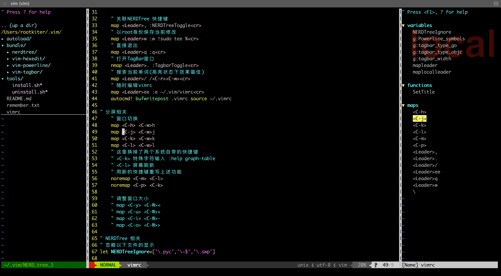

# VIM 基础配置

这里是一个极简的 VIM 配置，除兼具基础 IDE 的能力外，最大限度保留 VIM 原始操作的能力。
以方便在新机器上快速构建一个开发环境。同时由于插件很少，所以VIM的启动速度也会很快。

注意！这个配置的目标不是让 VIM 看起来更炫，而是让你更集中精力写BUG和修BUG。下面是一个配置后的效果图。



# 安装和卸载(Install And Uninstall)

这里记录的安装过程 (install.sh) 考虑了一个临时配置 IDE 环境，并在用后能够还原原有配置(uninstall.sh)的情况。

该情况适用于多人同时使用一个账号登陆服务器，或临时借用他人电脑的情况。可以避免不同人之间 VIM 配置出现冲突的情况。

## Install

先将已存在的 ~/.vim 配置备份到 ~/vim\_oldrc 中，随后从 github 同步具体配置到 ~/.vim

```
    $ curl https://raw.githubusercontent.com/rootkiter/vimhome/master/tools/install.sh | bash
```

## Uninstall

清除当前 ~/.vim 内容，再从 ~/vim\_oldrc 还原历史的配置。实现恢复。

```
    $ curl https://raw.githubusercontent.com/rootkiter/vimhome/master/tools/uninstall.sh | bash
```

# 上手帮助 (Help)

这里主要介绍四个插件的基础用法 （Pathogen/Nerdtree/Powerline + Tagbar）其他的插件可以自行根据需求扩展。

## 打开或关闭文件目录( Nerdtree )

在效果图中，区域 1 是文件目录区，该区域可通过输入 `,,` 序列实现展开和关闭，其中第一个字符 `,` 为引导符(vimrc 中设置的<Leader>)，第二个 `,` 为指令符。

此处，之所以选择 `,` 作为引导符是由于这个按键位置很好, 正好位于右手中指下侧，而其默认的指令又不常使用。所以在 vimrc 中我把 `,` 和 `\` 的功能做了替换。

在目录中选定要打开的文件后，可以通过 `i` / `s` 打开文件，两种操作分别为横向打开和纵向打开，效果图中就是同时打开三个文件的效果。

## 状态条（Powerline）

效果图中，区域 2 是一个状态条，这是 Powerline 的效果，它将在每个窗口的下侧出现，当状态条高亮时，表明当前窗口为正在活跃的窗口。

## 活跃窗口切换

在 vimrc 中，为窗口切换设置了映射。可以分别通过 <CTRL-H> <CTRL-J> <CTRL-K> <CTRL-L> 实现 “左” “下” “上” “右” 的切换。是在 HJKL 方向键基础上叠加 CTRL 来对应的。

## 插件管理器( Pathogen )

早期的 VIM 不具有管理插件的能力(新的VIM已经支持插件管理)，更新插件时很麻烦，要把相应的文件放到正确的目录才能生效。而 Pathogen 可以更方便的管理插件。

其主文件为 ~/.vim/autoload/pathogen.vim , 源自 tpope 的代码 https://github.com/tpope/vim-pathogen。具体的使用方式可自行前去参考。

当需要安装新插件时只需把相应的目录丢到 .vim/bundle/ 目录中即可。比如这个项目，就可以在 bundle 目录中看到 Nerdtree 和 Powerline 两个插件。

##  Tagbar 内容展示

项目默认不支持 Tagbar 插件，这是由于它需要配合 ctag 才能使用，而 ctag 在大部分环境下默认是不安装的，在 MocOS 下可以通过 `brew install ctags` 安装。

其次 Tagbar 插件可以通过 `git clone https://github.com/majutsushi/tagbar.git ~/.vim/bundle/vim-tagbar` 安装。

Tagbar 的展开和关闭 可以通过  `,.` 按键序列实现。其中 `,` 为引导符，`.` 为指令操作符。和 Nerdtree 的操作相对。展开后的展示图如下所示：



在 Tagbar 窗口中，选定标记后，按回车就可以跳转到对应位置。
